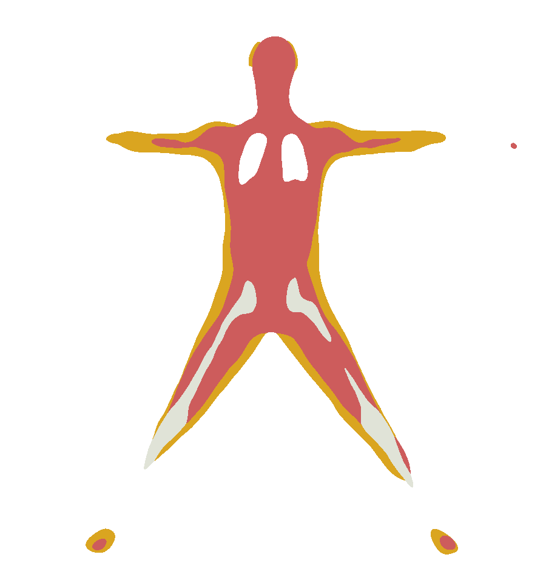

Code repo composed of multiple AI models to go from image to internal slices. 
Dependancies can be found at these links
  https://github.com/MarilynKeller/HIT/tree/main
  https://github.com/vchoutas/smplify-x/tree/master?tab=readme-ov-file
  https://github.com/CMU-Perceptual-Computing-Lab/openpose 
example image on guy.jpg stock image

